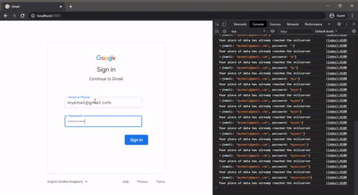

# Educational-Project-On-Phishing

- The source code in here is meant for educational purporses only. No user accounts were compromised in the making of this short tutorial.

- Checkout this twitter thread for the entire flow & context: https://twitter.com/daggieblanqx/status/1311835533677600774.

- Direct message me on twitter for any query.

# Installation Instructions:

## Prequisites:
	
- Have Node + NPM (https://nodejs.org/) and Yarn(https://yarnpkg.com/getting-started/install) installed in your computer.
	
## Steps
	
- Clone this repository in the computer that you have installed Node, NPM and Yarn on.

- Open the terminal and ``cd`` into the directory/folder containing the now cloned project.

- In this terminal, run the command ``yarn`` or ``npm install``

- Then open the file ``evil-server.js`` in your text editor and go to line 7 , and change the ``serverPort`` to your own preference.

- Then run the following command in your opened terminal ``yarn start``

- The evil server will launch. Open the server address in a browser to view the resulting phish page.